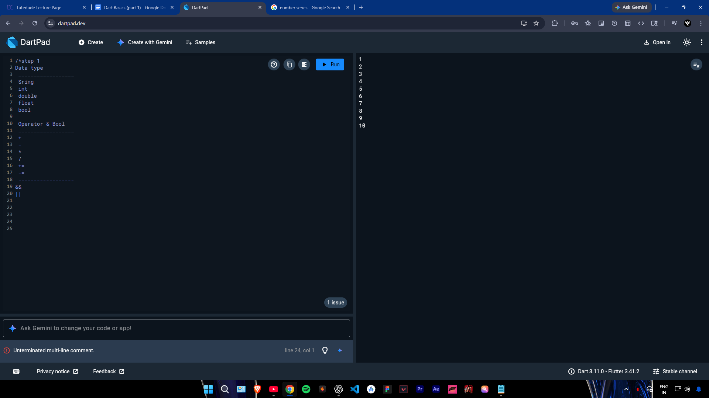
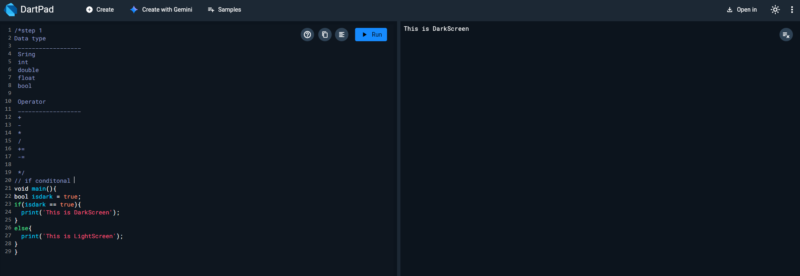
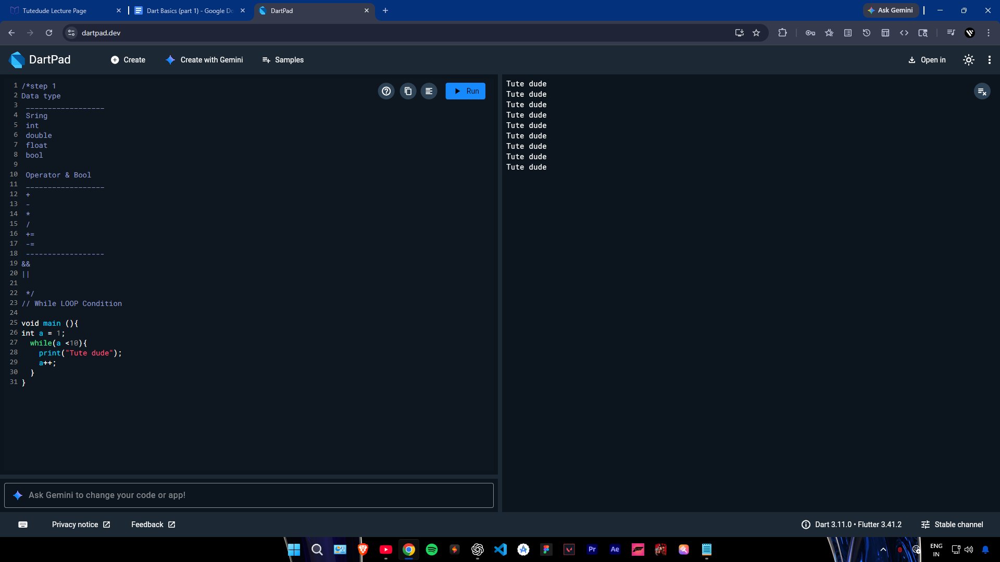
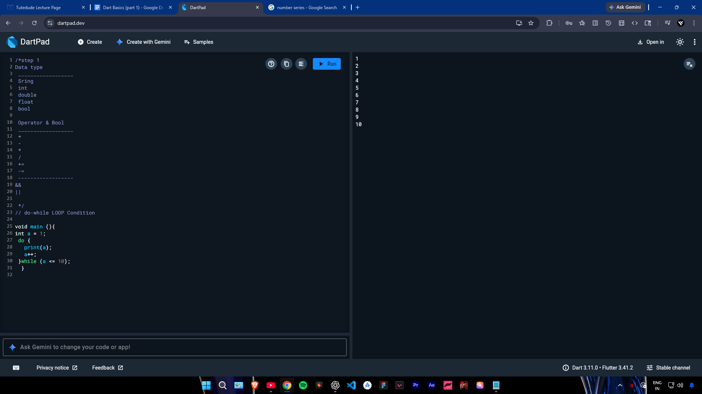
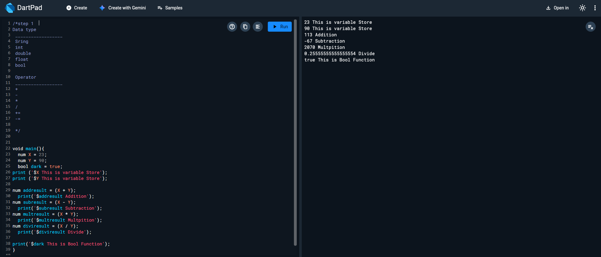
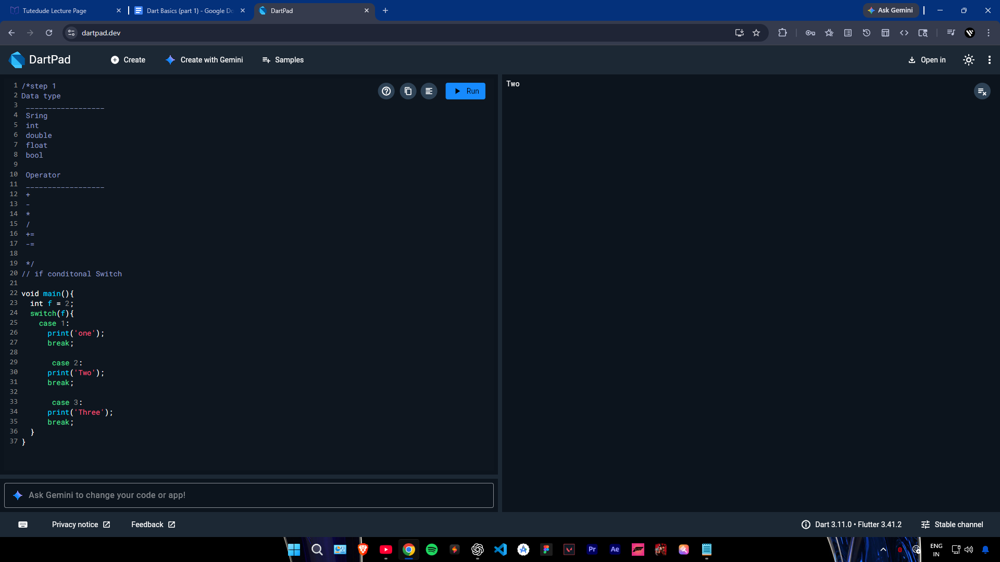

# DartBasic-Task-1
Learn Dart basics (variables, operators, conditions, loops), write simple programs (input/output, logic, loops), run them using dart run, ensure no errors, and keep code clean and organized.
## Data Types & Operators

## If Condition

## For Loop

## While Loop

## Do While Loop

## Logical Operations

## Switch Case

